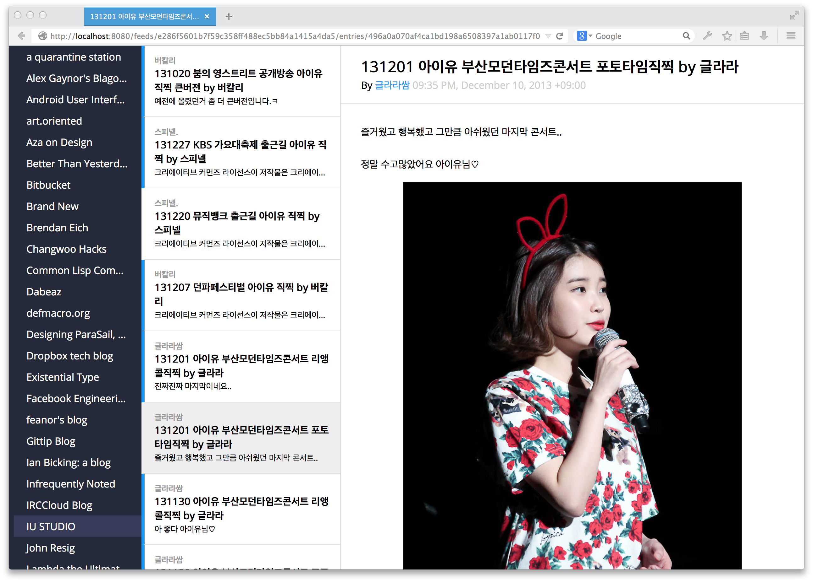

Ergae: Earth Reader on Google App Engine
========================================

How to setup development environment
------------------------------------

First of all you have to create a new virtual environment (of course it has
to be Python 2.7):

.. code-block:: console

   $ virtualenv -p `which python2.7` ergae-env
   $ . bin/ergae-env/activate
   (ergae-env)$

There are required third-party libraries.  The list of dependencies is
``requirements.txt``.  You can install them using ``pip`` in the virtual
environment:

.. code-block:: console

   (ergae-env)$ pip install -r requirements.txt
   Downloading/unpacking Flask>=0.10.1 (from -r requirements.txt (line 1))
   ...
   (ergae-env)$

To manage these dependences in the sandboxed environment Google App Engine
provides we have to use ``gaenv`` software:

.. code-block:: console

   (ergae-env)$ gaenv
   gaenv 
   Linked: flask
   ...
   Created /.../ergae/appengine_config.py
   Added [import gaenv_lib] in [/.../ergae/appengine_config.py]
   (ergae-env)$

Almost done.  Lastly copy ``app.yaml.dist`` to ``app.yaml``, and then
rename its ``application`` identifier from ``ergae`` to your own unique
identifier.

License
-------

Licensed under the terms of AGPLv3_.

.. _AGPLv3: http://www.gnu.org/licenses/agpl-3.0.html
